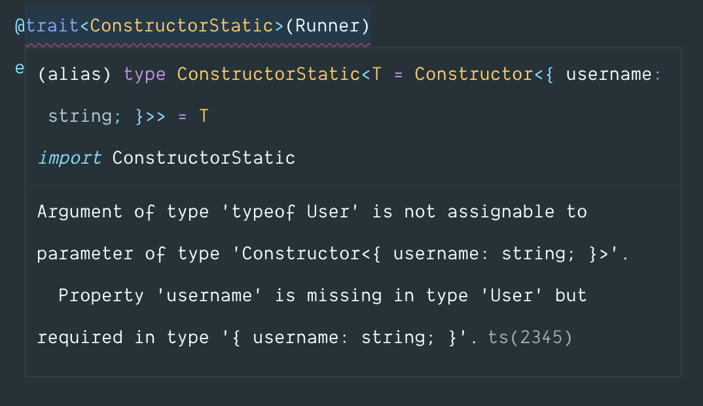

<!-- START doctoc generated TOC please keep comment here to allow auto update -->
<!-- DON'T EDIT THIS SECTION, INSTEAD RE-RUN doctoc TO UPDATE -->
## Table of contents

- [Traits](#traits)
  - [Inheritance](#inheritance)
  - [Why not mixins?](#why-not-mixins)
  - [Using Traits](#using-traits)
  - [Usage](#usage)
      - [Using as a decorator](#using-as-a-decorator)
      - [Using as a method](#using-as-a-method)
  - [Constraints](#constraints)
  - [Extending Typescript types](#extending-typescript-types)
  - [Maintainers](#maintainers)

<!-- END doctoc generated TOC please keep comment here to allow auto update -->

# Traits
> A tiny library to add support for Traits in Javascript and Typescript projects.

This library enables the support for using traits in your Javascript or Typescript codebase.

[![circleci-image]][circleci-url] [![npm-image]][npm-url] ![][typescript-image] [![license-image]][license-url]

## Inheritance
Since Javascript only allows extending a single class at a time, it can become harder to re-use code which relies on many concerns.

The Javascript inheritance model follows a vertical approach, so inheritance leads to classes that stack upon one another as layers of a cake. For example:

```js
class Person {
}

// These are concerns
class Runner {}
class Walker {}

class Walker extends Person {}
class Runner extends Walker {}

class User extends Runner {}
```

As you can notice, in order to add capabilities of a `Runner` and a `Walker` to a `User`, you have to stack extend calls on top of each other and have a nested `__proto__` to look for properties.

## Why not mixins?
Mixins follows the same approach of stacking extend calls on top of each other with using a function to do that instead. For example:

```js
function Runner (Base) {
  return class Runner extends Base {}
}

function Walker (Base) {
  return class Walker extends Base {}
}
```

This is infact [suggested by many](https://basarat.gitbooks.io/typescript/docs/types/mixins.html) in the Typescript community.

## Using Traits
Traits follows a simple approach of copying the members of a trait to the destination class, which means after a trait is applied, that class will be garbage collected right away and you are always working with the destination class object.

Also, this library enforces some constraints to keep the code simpler and easy to reason about.

- **Only methods are allowed**: Traits cannot define it's own state or properties that are not methods. If a trait needs some state to operate, then it can enforce the parent class to define that. 
- **Getters/setters are allowed**: Getters & setters are allowed, since they operate on a pre-existing state.
- **Static properties are allowed**: We will copy the static properties to the destination class.
- **Prototype properties are allowed**: We will copy the prototype properties to the destination class.

## Usage
Install the package from npm registry as follows:

```
npm i @poppinss/traits

# yarn
yarn add @poppinss/traits
```

and use it as follows:

#### Using as a decorator
```ts
import { trait } from '@poppinss/traits'

class Runner {
  run () {}
}

class Walker {
  walk () {}
}

class Person {}

@trait(Runner)
@trait(Walker)
export class User extends Person {}
```

The `trait` decorator will copy the `run` and `walk` methods to the `User` class and `this` inside those methods will point towards the `User` class instance.

#### Using as a method
If you are not using decorators, then you can make use of the `applyTraits` method instead.

```js
class User extends Person {}

applyTraits(User, [Runner, Walker])
module.exports = User
```

## Constraints
As mentioned earlier, the traits cannot define state as it will result in an error.

```ts
class Runner {
  public username = 'virk'
  public run () {
    return `${this.username} runs`
  }
}
```

When using `Runner` as a trait, a runtime exception will be raised that `username` is not allowed to be set. Instead, you can enforce the consumer of trait to define the `username`. Doing this in Typescript is even simpler with compile time feedback.

```ts
export class Runner {
  public username = 'virk'
  public run () {
    return `${this.username} runs`
  }
}

type Constructor<T> = { new (): T }
export type ConstructorStatic<T = Constructor<{ username: string }>> = T
```

Usage

```ts
import { trait } from '@poppinss/traits'
import { Runner, ConstructorStatic } from './Runner'

@trait<ConstructorStatic>(Runner)
class User {}
```

Compile time error



Fix it by defining it inside the `User` class.

```ts
@trait<ConstructorStatic>(Runner)
class User {
  public username: string
}
```

## Extending Typescript types
Unfortunately, Typescript [doesn't allow decorators](https://github.com/microsoft/TypeScript/issues/4881) to extend the types of the source class and hence you will have to manually extend the types of the traits you are using. For example:

```ts
@trait(Runner)
class UserBase {
  public username: string
}

const User = UserBase as unknown as (typeof UserBase & typeof Runner) & {
  new (): UserBase & Runner,
}

export default User
```

after this, the `run` method will show up on the `User` class as well.


Another option is to make use of interface with the same name as the class
```ts
interface User {
  run (): string
  username: string
}

@trait(Runner)
class User {
  public username: string
}
```

## Maintainers
[Harminder virk](https://github.com/thetutlage)

[circleci-image]: https://img.shields.io/circleci/project/github/poppinss/traits/master.svg?style=for-the-badge&logo=circleci
[circleci-url]: https://circleci.com/gh/poppinss/traits "circleci"

[npm-image]: https://img.shields.io/npm/v/@poppinss/traits.svg?style=for-the-badge&logo=npm
[npm-url]: https://npmjs.org/package/@poppinss/traits "npm"

[typescript-image]: https://img.shields.io/badge/Typescript-294E80.svg?style=for-the-badge&logo=typescript

[license-url]: LICENSE.md
[license-image]: https://img.shields.io/aur/license/pac.svg?style=for-the-badge
